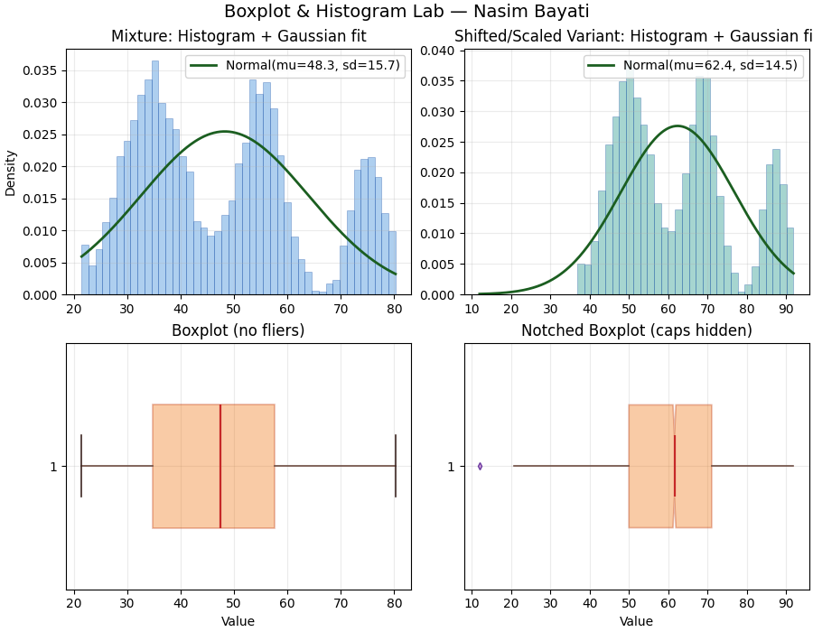

# Boxplot & Histogram Lab

An original matplotlib mini-project that explores distributions with **histograms + Gaussian overlays** and **custom-styled boxplots**.

## Why this is different
- Fresh synthetic datasets (trimodal mixture + shifted/scaled variant with injected outliers)
- Distinct 2×2 layout and color system
- Horizontal boxplots, notched style, and configurable fliers/caps
- No external dependencies beyond `numpy` and `matplotlib`

## What it shows
- Sampling a mixture distribution and a transformed variant
- Estimating mean/standard deviation and overlaying a normal PDF
- Reading distribution shape alongside box-and-whisker summaries

## Run it
```bash
python boxplot_lab.py
```

## Save a preview image for GitHub
```bash
python -c "import boxplot_lab as b; b.main(save_png=True)"
```
This writes **boxplot_lab.png** next to the script.

## Files
- `boxplot_lab.py` — main script (pure matplotlib + numpy)
- `README_boxplot_lab.md` — this file

  ## 📷 Output


## Requirements
- Python 3.8+
- `matplotlib`, `numpy`

## License
MIT — use and adapt freely.
